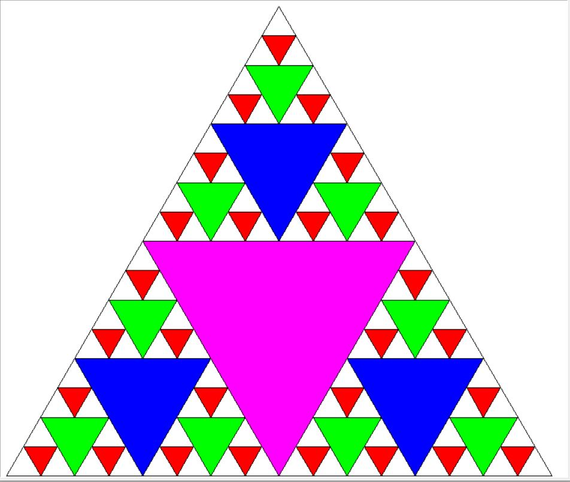

# Sierpinski

The Sierpinski Triangle is a fractal pattern created by recursively dividing a triangle into smaller equilateral triangles. This process is repeated, forming a self-replicating geometric design. It is named after the Polish mathematician Wacław Sierpiński and is widely used in computer graphics and mathematics to demonstrate recursive structures. 

## Prerequisites

```python
import math
from turtle import Turtle, Screen
```

## Example

When you enter a positive natural number (3 or greater than 3) as input to the main function, the function will draw the pattern recursively.

Number of iterations:  4


